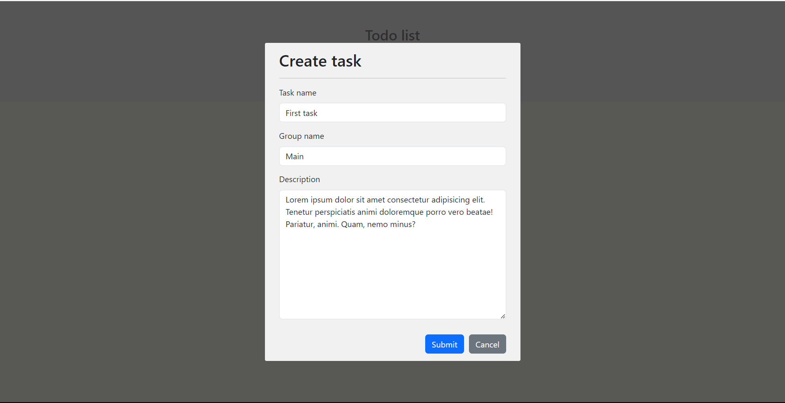

# Note Management Web Page

This web page is a simple note management application built using React, JavaScript, HTML, and CSS. It offers functionality for creating, editing, categorizing notes into groups, moving notes between groups, and deleting notes. Notes are stored locally using localStorage for persistence.

## Table of Contents

- Features
- Getting Started
- Usage
- Technologies Used

## Features

- Create Notes: Users can create new notes with a title and content.
- Edit Notes: Existing notes can be edited to update their content.
- Note Grouping: Notes can be categorized into different groups for organization.
- Move Between Groups: Users can move notes from one group to another.
- Delete Notes: Notes can be deleted individually.
- Data Persistence: Notes are stored in the browser's localStorage, ensuring they persist across sessions.

## Getting Started

To run this web page locally, follow these steps:

1. Clone the repository to your local machine:

```bash
git clone https://github.com/your-username/note-management-webpage.git
```

2. Navigate to the project directory:

```bash
cd note-management-webpage
```

3. Install the required dependencies:

```bash
npm install
```

4. Start the development server:

```bash
npm start
```

5. Open your web browser and go to http://localhost:3000 to access the note management web page.

## Usage

- Create new notes by clicking the "New Note" button.
- Edit existing notes by clicking on a note in the list and making changes in the editor.
- Assign notes to different groups using the dropdown menu in the note editor.
- Move notes between groups by changing the group assignment and saving the note.
- Delete notes by selecting a note and clicking the "Delete" button.

## Technologies Used

- React
- JavaScript (JS)
- HTML
- CSS
- Bootstrap(a little bit)

## Screenshots

1. Starting page


2. Create task



3. Main UI/UX


